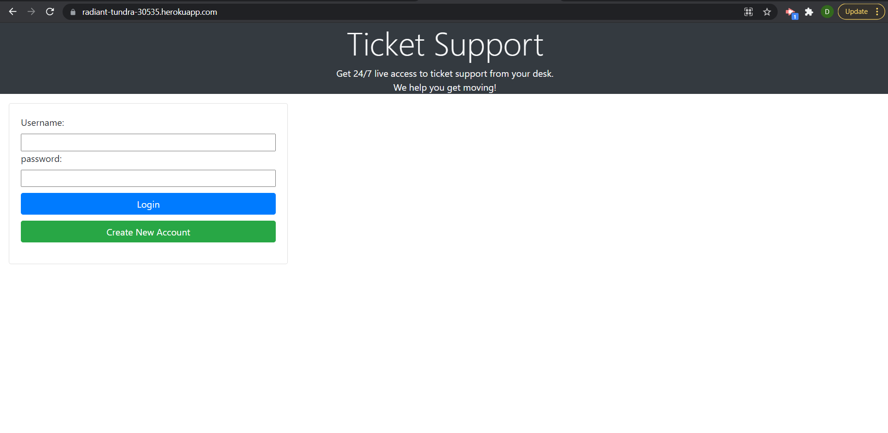
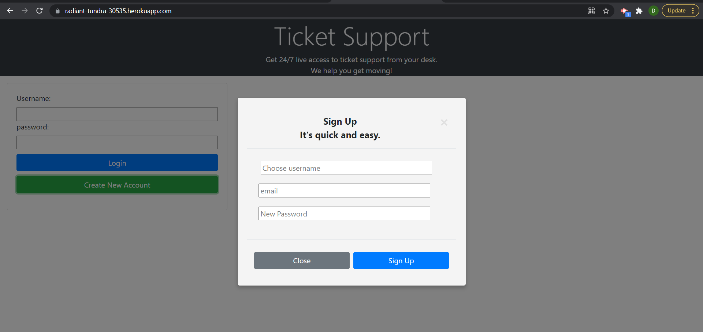
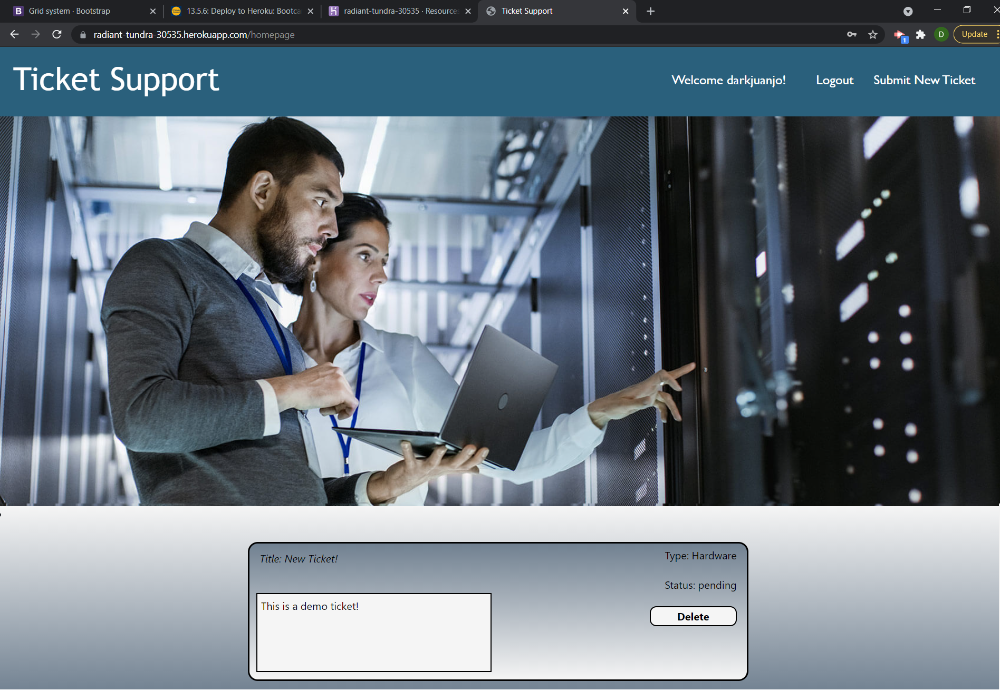

# Ticket-Support

## Description 

The purpose of this project is test our Full Stack programming knowlege by creating fully functional webpage with their respective front end and back end parts. 

## Project Requirements 
 * Use Node.js and Express.js
 * Be a RESTful API.
 * Use Handlebars template engine.
 * Use MySQL and Sequelize ORM.
 * Have both GET and POST routes for retrieving and adding new data.
 * Be deployed to Heroku.
 * Use atleast one new technoloy not discussed in class.
 * Polished UI.
 * Be Responsive.
 * Be Interactive.
 * MVC folder structure.
 * User Authentication.
 * Proctected API keys.
 * Clean Repository.

## Table of Contents

* [Installation Manual](#installation-manual)
* [Usage Usage Manual](#usage-manual)
* [Usage Usage Heroku](#usage-heroku)
* [Screenshots](#screenshots)
* [License](#license)

## Installation-Manual

1. Download/Clone app from github repository
2. Open terminal and navigate to the root folder of the app (It should contain the server.js file).
3. Run the `npm install` command to automatically install all the required dependencies.
4. Create a new MYSQL database with the name help_ticket_support_db;
5. Once the dependencies finish installing and the MYSQL database was create run the `node server.js` to launch the application.

## Usage-Manual

1. Open terminal and navigate to the root folderof the application.
2. Once you are in the root folder run the command `node server.js`
3. Once the server starts open local host 3001 in your web browser.
4. Create a User and login to the database.
5. Create/Delete a ticket from the database.

## Usage Heroku

1. Open https://radiant-tundra-30535.herokuapp.com/.
2. Create a User and login to the database.
3. Create/Delete a ticket from the database.

## Screenshots

### Login Page

### Create User

### Homepage Page

### Create Ticket Page

## License

ISC
    
